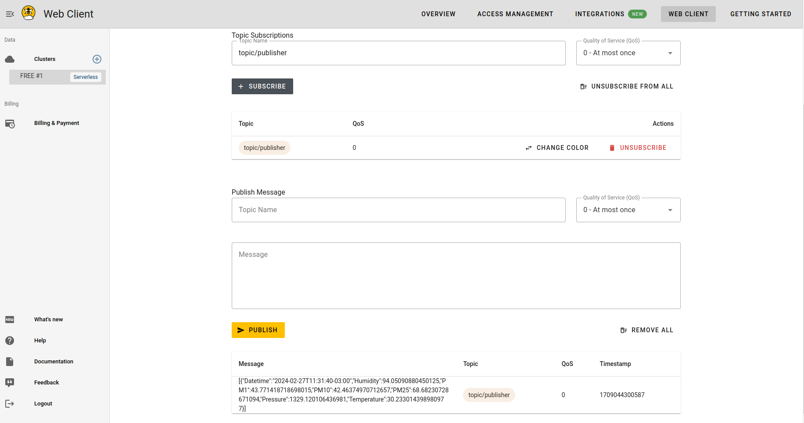

# Pondera 1 - Simulador de dispositivos IoT

## Objetivo

Criar um simulador de dispositivos IoT utilizando o protocolo MQTT através do uso da biblioteca Eclipse Paho.

## Sensor

Sensor escolhido: SPS30

### Construtor

Visando uma mutabilidade fácil, foi criado a coleta de dados por meio de um json, onde se passa o atributo e o valor maximo ou minimo que o sensor pode coletar.

```json
	[
		{ "PM1": 100,
    	"PM10": 100,
    	"PM25": 100,
    	"Datetime": "2019-12-01T00:00:00Z",
    	"Temperature": 50,
    	"Humidity": 100,
    	"Pressure": 2000
		}
	]
```

Onde no código, é feito a leitura do json, verificação dos dados e transformação dos dados para o formato de envio.

## Como Rodar

### Script

1. Após rodar o mosquito em sua maquina local, com o comando:

```bash

    mosquitto -c mosquitto.conf

```

2. Abra um novo terminal e acesse o diretório do projeto, com o seguinte comando:

```bash

    cd P1/src

```

3. Crie um arquivo `.env` com as seguintes variáveis:

```bash

	MQTT_HOST=
	HIVE_USER=usuário
	HIVE_PSWD=senha
	BROKER_ADDR=host
```

4. Agora, rode o seguinte comando:

```bash
  
    chmod +x start.sh
  
```

5. Rode o seguinte comando para instalar as dependências do projeto e executar o simulador:

```bash

    ./start.sh

```

6. O simulador irá rodar e enviará mensagens para o tópico `sensor` a cada 1 segundos.

## Demonstração



[Vídeo de monstração](https://drive.google.com/file/d/1rJ73duxCnO5NPMY8a6HWGtOaIWBJj-Va/view?usp=drive_link)
